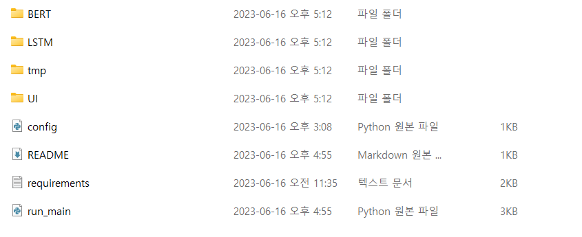

python=3.7.5에서 개발을 진행했습니다.

anaconda로 가상환경 설정 이후  
$pip install -r requirements.txt 를 통해서 라이브러리를 설치해 주셔야 합니다.

config.py에서 path를 로컬 환경에 맞게 설정을 변경해야 합니다.

BERT trained model은 아래 링크에서 압축파일을 다운 받고 압축을 해제하고 각 폴더에 위치시켜야 합니다.

훈련된 모델 다운

- eye color

  - `BERT/trained_model/bert_eye_color`
  - https://drive.google.com/file/d/1Uvi63NsQV4j-LpZYMmpIjHi6JZkxzcD3/view?usp=sharing

- hair color

  - `BERT/trained_model/bert_hair_color`
  - https://drive.google.com/file/d/1tJfdvmknNMfpj14VCB6GDV8_4R-PCCV5/view?usp=sharing

  - BERT pretrained model
    - https://tfhub.dev/google/bert_uncased_L-12_H-768_A-12/1?tf-hub-format=compressed
    - $tar -zxvf {tar.gz file} ./tmp
    - code/ 에 압축을 푼 tmp/ 을 위치시킨다.

run_main.py를 실행하면 프로그램을 실행합니다.
